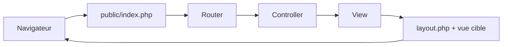

# Guide detaille de la structure et de l architecture - HireIn

## 1. But de ce document
Ce document explique :
- les dossiers et fichiers du projet,
- le role de chaque element,
- comment l application fonctionne de bout en bout,
- comment les couches communiquent entre elles.

L objectif est de rendre le code comprensible meme pour une personne non initiee.

## 2. Vue globale du projet
Le projet suit une architecture MVC simple en PHP :
- M (Model): couche donnees (base SQL + connexion),
- V (View): pages affichees dans le navigateur,
- C (Controller): logique qui recoit la requete et decide quoi afficher.

Dans cette version, la partie Model est preparee (schema SQL + classe Database), et la partie Controller/View est deja fonctionnelle pour Accueil et Offres.

## 3. Arborescence et role de chaque dossier

### 3.1 Dossier public/
Point d entree HTTP de l application.

- public/index.php
  - Raison d etre: c est le fichier execute quand un utilisateur ouvre le site.
  - Role:
    - charge automatiquement les classes PHP (autoload),
    - declare les routes (URL -> controller + methode),
    - lit la requete (methode HTTP et chemin URL),
    - envoie la requete au routeur.

### 3.2 Dossier app/
Coeur applicatif.

#### a) app/Core/
Contient les briques techniques communes.

- app/Core/Router.php
  - Gere la table des routes GET/POST.
  - Normalise les chemins (ex: /offres et /offres/).
  - Trouve le handler et lance le controller correspondant.
  - Retourne 404 si la route n existe pas.

- app/Core/Controller.php
  - Classe de base des controllers.
  - Fournit la methode view() pour afficher une vue avec des donnees.

- app/Core/View.php
  - Moteur de rendu des vues.
  - Prend un nom de vue (ex: offers.index),
  - charge le fichier de vue,
  - injecte les donnees dans la vue,
  - capture le contenu HTML,
  - applique ensuite le layout global.

- app/Core/Database.php
  - Prepare la connexion PDO vers MySQL.
  - Utilise la configuration (host, port, database, username, password).
  - Retourne un objet de connexion reutilisable.

#### b) app/Controllers/
Contient la logique applicative liee aux routes.

- app/Controllers/HomeController.php
  - Action index(): affiche la page d accueil.

- app/Controllers/OfferController.php
  - Action index(): prepare une liste d offres exemple.
  - Envoie ces donnees a la vue des offres.

#### c) app/Views/
Contient les templates HTML/PHP (ce que voit l utilisateur).

- app/Views/layout.php
  - Gabarit global commun (header, nav, main, footer).
  - Recoit le contenu de la vue courante via la variable $content.

- app/Views/home.php
  - Contenu specifique de la page d accueil.

- app/Views/offers/index.php
  - Contenu de la page Offres.
  - Parcourt la liste des offres et les affiche.
  - Echappe les valeurs via htmlspecialchars pour eviter l injection HTML.

### 3.3 Dossier config/
Contient les parametres de l application.

- config/app.php
  - Parametres generaux: nom app, environnement, debug, URL.
  - Lit les variables d environnement avec des valeurs par defaut.

- config/database.php
  - Parametres de connexion base de donnees.
  - Lit DB_HOST, DB_PORT, DB_DATABASE, DB_USERNAME, DB_PASSWORD.

### 3.4 Dossier database/
Contient la structure de donnees SQL.

- database/schema.sql
  - Definit les tables principales:
    - users,
    - student_profiles,
    - company_profiles,
    - offers,
    - applications.
  - Defini les cles primaires et etrangeres.
  - Structure les relations entre utilisateurs, entreprises, offres et candidatures.

## 4. Fichiers racine utiles

- .env.example
  - Modele de variables d environnement.
  - Sert de base pour creer un futur fichier .env local.

- .gitignore
  - Ignore les fichiers qui ne doivent pas etre commits (ex: .env).

- README.md
  - Documentation fonctionnelle et vision du projet.

- cahier-de-charges.md
  - Cadrage besoin, objectifs, perimetre.

- methodologie.md
  - Organisation de travail et suivi.

- analyse.md
  - Personas, besoins, parcours et diagrammes.

- architecture.md
  - Vue d ensemble de l architecture proposee.

## 5. Comment les couches communiquent entre elles

## 5.1 Flux complet d une requete web
Exemple: utilisateur ouvre /offres.

1. Le navigateur envoie une requete HTTP GET /offres.
2. public/index.php recoit la requete.
3. index.php demande au Router de dispatcher.
4. Router trouve la route /offres -> OfferController::index.
5. OfferController prepare les donnees (offres).
6. OfferController appelle view('offers.index', donnees).
7. View charge app/Views/offers/index.php.
8. View capture le HTML genere et l injecte dans app/Views/layout.php.
9. Le HTML final est renvoye au navigateur.

## 5.2 Diagramme de communication (runtime)

## 5.3 Communication avec la base de donnees (preparation)
Dans l etat actuel:
- la base est prete structurellement (schema.sql),
- la classe Database est prete pour la connexion,
- les controllers utilisent encore des donnees en memoire (tableaux PHP).

Quand la couche persistance sera activee:
1. Controller demandera des donnees via une classe metier/repository,
2. cette classe utilisera Database::connect(),
3. SQL sera execute sur MySQL,
4. resultat retournera au controller,
5. controller enverra ces donnees a la vue.

## 6. Pourquoi cette architecture est adaptee a une soutenance
- Claire: separation nette entre routage, logique et affichage.
- Pedagogique: chaque dossier a une responsabilite simple.
- Evolutive: facile d ajouter Auth, CRUD Offres, Candidatures.
- Traçable: commits atomiques deja mis en place par fonctionnalite.

## 7. Limites actuelles (normales pour un debut)
- Pas encore de vraie connexion DB utilisee dans les controllers.
- Pas encore d authentification utilisateurs.
- Pas encore de formulaires de creation d offres/candidatures.

## 8. Prochaine evolution recommandee
Ordre conseille:
1. Activer la connexion DB et lire les offres depuis MySQL.
2. Ajouter Auth (etudiant, entreprise, admin).
3. Ajouter creation d offre cote entreprise.
4. Ajouter candidature cote etudiant.
5. Ajouter espace admin minimal.

## 9. Resume court
Le projet est organise autour d un noyau MVC simple:
- public/index.php entre les requetes,
- Router choisit l action,
- Controller prepare les donnees,
- View fabrique la page,
- layout applique l interface commune,
- database/schema.sql et Database.php preparent la persistence.

Cette architecture est propre, lisible et defendable devant un jury.
